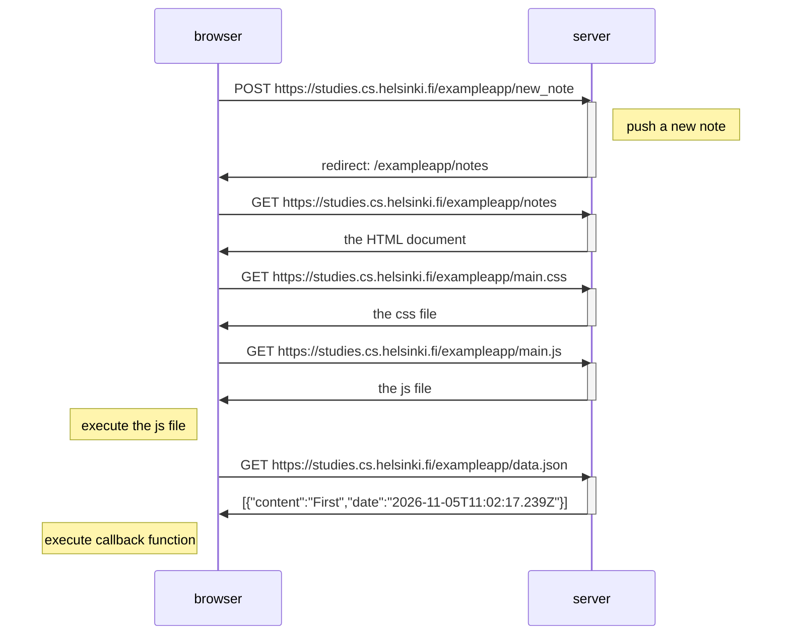

```mermaid
sequenceDiagram
    browser->>server: POST https://studies.cs.helsinki.fi/exampleapp/new_note
    activate server
    Note right of server: push a new note 
    server->>browser: redirect: /exampleapp/notes
    deactivate server

    browser->>server:GET https://studies.cs.helsinki.fi/exampleapp/notes
    activate server
    server->>browser:the HTML document
    deactivate server

    browser->>server:GET https://studies.cs.helsinki.fi/exampleapp/main.css
    activate server
    server->>browser:the css file
    deactivate server

    browser->>server:GET https://studies.cs.helsinki.fi/exampleapp/main.js
    activate server
    server->>browser:the js file
    deactivate server
    note left of browser: execute the js file

    browser->>server:GET https://studies.cs.helsinki.fi/exampleapp/data.json
    activate server
    server->>browser:[{"content":"First","date":"2026-11-05T11:02:17.239Z"}]
    deactivate server
    note left of browser: execute callback function
```
