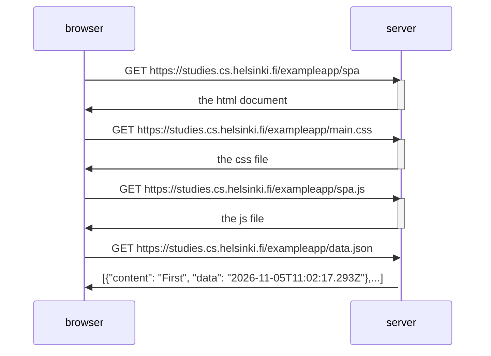

```mermaid
sequenceDiagram
  browser->>server:GET https://studies.cs.helsinki.fi/exampleapp/spa
  activate server
  server->>browser:the html document
  deactivate server

  browser->>server:GET https://studies.cs.helsinki.fi/exampleapp/main.css
  activate server
  server->>browser:the css file
  deactivate server

  browser->>server:GET https://studies.cs.helsinki.fi/exampleapp/spa.js
  activate server
  server->>browser:the js file
  deactivate server

  browser->>server:GET https://studies.cs.helsinki.fi/exampleapp/data.json
  activate server
  server->>browser:[{"content": "First", "data": "2026-11-05T11:02:17.293Z"},...]
```
